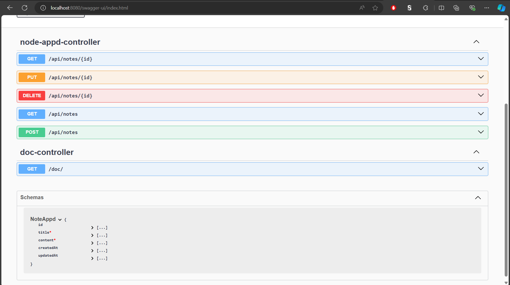

# **Select Language:** 🌍
- [Español (Spanish)](README-es.md)
- [English](README.md)

# Proyecto Hibernate con Spring Boot

Este proyecto implementa una API RESTful utilizando Hibernate y Spring Boot para la gestión de notas.

## RESULTS
### Swagger Documentation

## Estructura del Proyecto

El proyecto está organizado en varios paquetes:

- `models`: Contiene las entidades JPA para las notas.
- `exceptions`: Define excepciones personalizadas para manejar errores.
- `controller`: Contiene los controladores REST para manipular las notas y la documentación.
- `config`: Configuración del proyecto, incluyendo la configuración de OpenAPI.

## Funcionalidades

- **Notas (`NoteAppd`)**: Permite la creación, actualización, eliminación y consulta de notas.
- **Manejo de Excepciones**: Se manejan excepciones personalizadas para recursos no encontrados.
- **Documentación**: Utiliza Swagger para documentar la API.

## Endpoints Principales

- `GET /api/notes`: Obtiene todas las notas.
- `POST /api/notes`: Crea una nueva nota.
- `GET /api/notes/{id}`: Obtiene una nota por su ID.
- `PUT /api/notes/{id}`: Actualiza una nota existente.
- `DELETE /api/notes/{id}`: Elimina una nota por su ID.
- `GET /doc/`: Redirige a la documentación Swagger.

## Configuración

- La configuración de Swagger está disponible en `OpenApiConfig.java`.
- La aplicación utiliza auditaría de entidades con Spring Data JPA.

## Documentación

Para visualizar la documentación de la API, accede a `/swagger-ui.html` en tu navegador.

## Contacto

Desarrollado por Anyel EC.
Email: cyberdevmatrix@gmail.com

